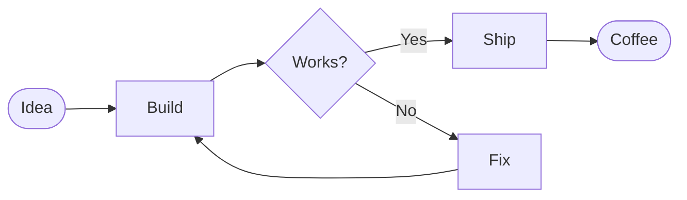
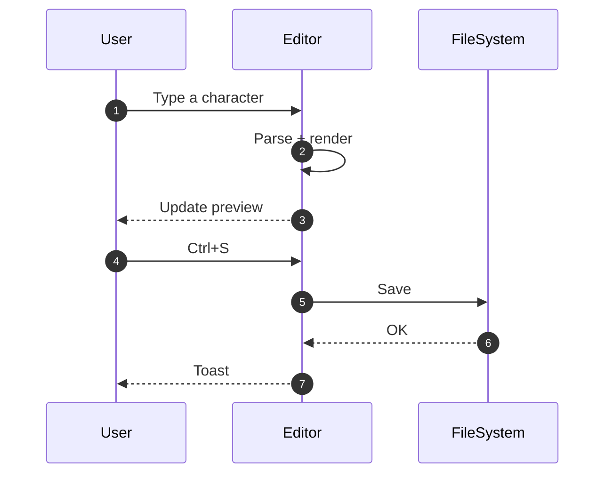
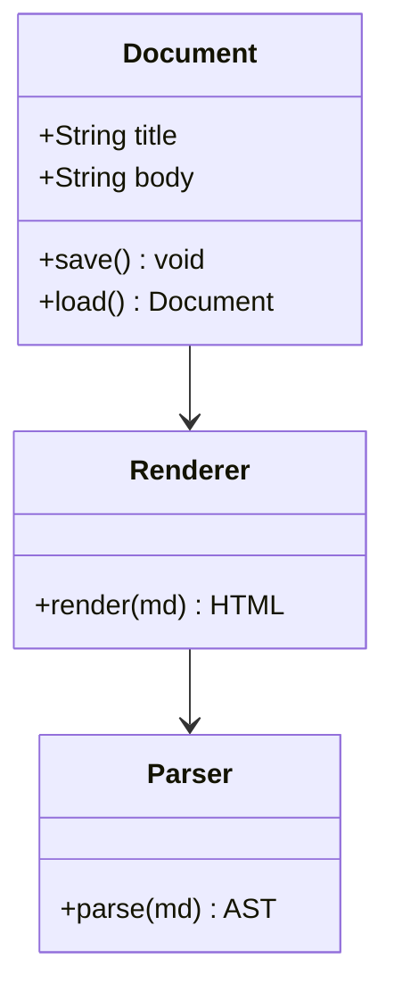
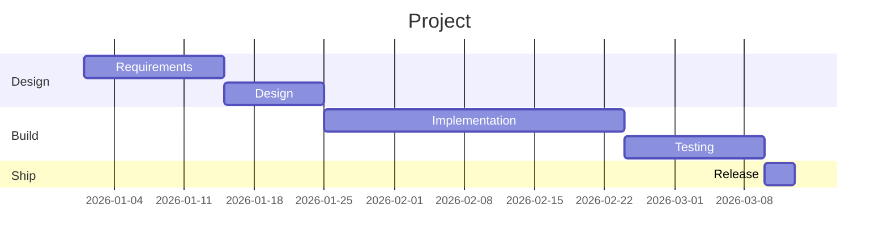
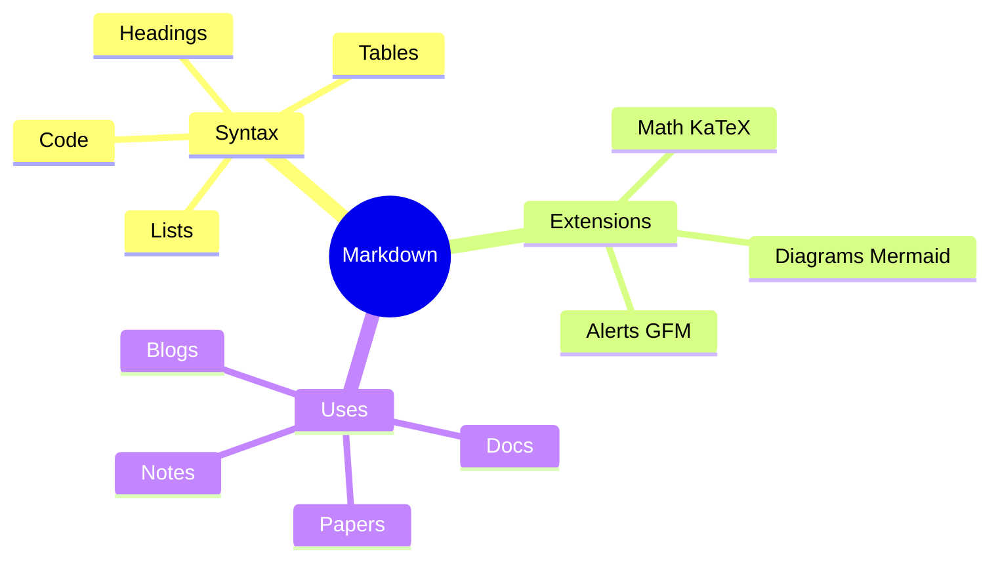
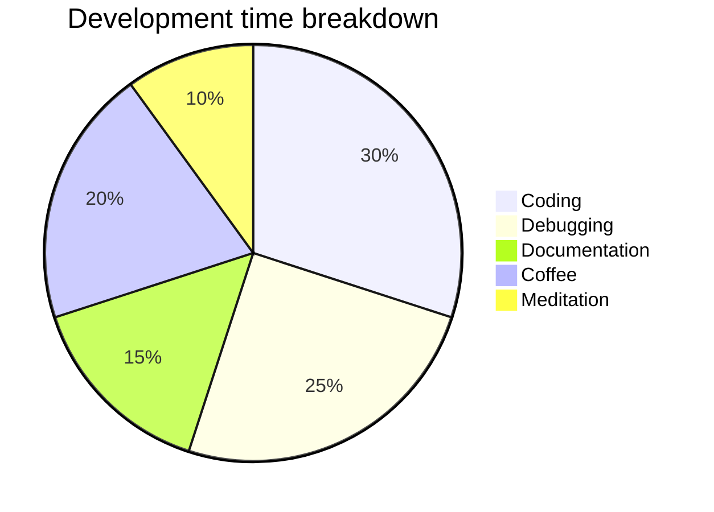
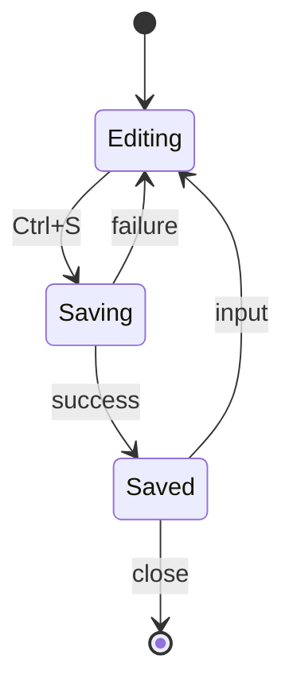
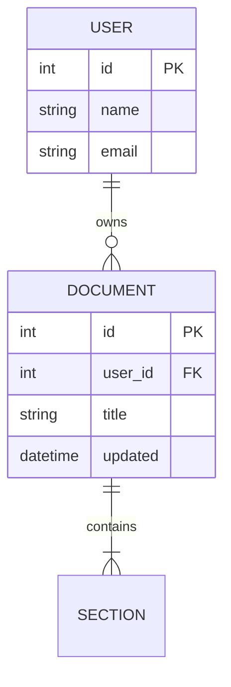

# Markdown Studio

> *One HTML file. Zero dependencies. No server. Just you and your browser.*

[](LICENSE)
[](#)
[](#)
[](#)
[](#)

**Markdown Studio** is a single HTML file for people who want to write Markdown seriously.
Double-click to open. Close to leave nothing behind (unless you pressed "Save").
It doesn't depend on the internet. It doesn't depend on your mood, either.

This document was written in Markdown Studio, can be opened in Markdown Studio, and is about Markdown Studio. **Meta.**

---

## Table of Contents

1. [Why](#why)
2. [What it does](#what-it-does)
3. [How to use (a very short chapter)](#how-to-use-a-very-short-chapter)
4. [Features (a very long chapter)](#features-a-very-long-chapter)
5. [Markdown, the full menu](#markdown-the-full-menu)
6. [Math (KaTeX)](#math-katex)
7. [Diagrams (Mermaid)](#diagrams-mermaid)
8. [Templates](#templates)
9. [Keyboard shortcuts](#keyboard-shortcuts)
10. [Privacy](#privacy)
11. [FAQ](#faq)
12. [Known "bugs" (and how we call them "features")](#known-bugs-and-how-we-call-them-features)
13. [License](#license)

---

## Why

A confession upfront: **there are too many Markdown editors in the world.**

VS Code extensions, Obsidian, Typora, StackEdit, Bear, HackMD, Notion—
each is wonderful. And yet, each demands something. A signup. An install. A subscription. A Node.js. A `.config` folder with 3,847 files.

> "Please sign in."
> "Consider our Pro subscription."
> "Please update to the latest version."
> "Please install Node.js 18 or later."
> "May I create a folder with 3,847 files in `.config`?"

**Double-click to open. Type. Save. Close.**
Is that hard? …no, it isn't. It's one HTML file.

Markdown Studio exists for the moment when, at 2 a.m., you realize you just want to write Markdown.
Your 2 a.m. deserves something more useful than reading docs about a Markdown editor.

---

## What it does

- ✓ Write Markdown source
- ✓ See preview next to it
- ✓ Edit the rendered output directly (WYSIWYG)
- ✓ Typeset math (KaTeX)
- ✓ Draw diagrams (Mermaid)
- ✓ Find & Replace (regex supported)
- ✓ Save (as a normal file)
- ✓ Open (a normal file / drag & drop)
- ✓ Export (HTML / PDF / TXT)
- ✗ Send to a server
- ✗ Charge you
- ✗ Watch you

---

## How to use (a very short chapter)

```text
1. Double-click markdown_studio_en.html
2. Type
3. Ctrl/⌘ + S to save
```

**That's the whole chapter**. It ends here.

> [!TIP]
> One whole chapter just said that. It can't get any shorter. A haiku still has room.

---

## Features (a very long chapter)

Where a chapter is short, another chapter is long. Balance.

### Four view modes

| Mode | What happens |
| --- | --- |
| **Edit** | Source only. Channel your inner Vim. |
| **Split** | Source on the left, preview on the right. The default. |
| **Preview** | Output only. For demos. |
| **WYSIWYG** | Edit the rendered output directly. For Word survivors. |

### Word-style input helpers

- Tab inserts indent. Shift+Tab outdents.
- Enter in a list continues the list (auto-numbers ordered ones).
- Enter on an empty list item terminates the list.
- Cursor position (line, column) is in the status bar.
- Line numbers in the gutter, always.

### File operations

- **New** — Start fresh.
- **Open** — Load a local `.md`.
- **Save** — Save as the current filename.
- **Save As** — Choose a filename.
- **Export** — HTML (self-contained), PDF (via print), Plain text.
- **Open by drag & drop** — Drop a `.md`, `.markdown`, or `.txt` file anywhere on the app to load it. A blue overlay shows up during drag.

> [!NOTE]
> There is **no autosave**. If you close without Ctrl+S, your edits are gone. The page will warn you on close if there are unsaved changes.

### Find & Replace

`Ctrl/⌘ + F` opens the find bar.
- Case-sensitive option
- Regular expression option
- Replace / Replace All

### Math (KaTeX)

`$ ... $` inline. `$$ ... $$` block.
The Math button on the toolbar opens **a panel with 90+ templates across 8 categories**:
fractions, square roots, sums, integrals, matrices, cases, Greek letters, and famous equations (yes, Euler's identity and Schrödinger).

### Diagrams (Mermaid)

The Diagram button opens a panel with **12 diagram templates with rendered SVG previews**:
- Flowchart (TD / LR)
- Sequence
- Class
- State
- ER
- Gantt
- Pie
- Mindmap
- Timeline
- Quadrant
- User Journey

Each diagram type comes with a **builder GUI** for adding nodes, arrows, subgraphs, and hierarchy.

**Node shape picker** (flowchart only) — Insert any of **12 shapes** with one click: rectangle, rounded, stadium, subroutine, cylinder, circle, rhombus, hexagon, parallelogram, trapezoid, asymmetric, double circle. Each button shows an SVG icon of the shape, and IDs are auto-incremented (`N1`, `N2`, ...).

**Colors are customizable too.** Theme (5) and palette (8 + 8 pastel) change the whole diagram. **Per-node colors** (20) are supported for `flowchart`, `classDiagram`, `stateDiagram`, and `sequenceDiagram`. Other types (`gantt`, `pie`, `mindmap`, `timeline`, `erDiagram`, `quadrantChart`, `journey`) accept palette-level coloring only.

### Templates

16 built-in document templates:
- **OSS**: README.md
- **Tech**: Technical Spec / Requirements / Design Doc / API Reference / ADR / Release Notes
- **Business**: Meeting Notes / Status Report / Proposal / Review Notes / Contract Draft
- **Academic**: Paper (English Conference) / Thesis
- **Writing**: Blog Post / Notes / Task List

### Theme

Light / Dark. Persists in localStorage.
Dark is easy on the eyes; Light is easy on the printer.

### Font size

`Ctrl/⌘ + +` / `Ctrl/⌘ + -` / `Ctrl/⌘ + 0`.

### Image embedding

Pick a local image in the Image dialog: it's **embedded as Base64 right inside the file**.
The result is a single self-contained HTML. Email it as one file (the recipient may say "what is this," but technically it works).

---

## Markdown, the full menu

What follows is a live demo of what Markdown can do. Everything below renders both in GitHub and in this editor.

### 1. Headings

# Heading 1
## Heading 2
### Heading 3
#### Heading 4
##### Heading 5
###### Heading 6

### 2. Paragraphs and inline

A normal paragraph. With **bold**, *italic*, ***both***, ~~strikethrough~~, and `inline code`.

End a line with two spaces to force a break.  
(Like this.)

### 3. Lists

#### Unordered

- First item
- Second item
  - Nested
    - Grandchild
- Third item

#### Ordered

1. One
2. Two
3. Three
   1. Nested
   2. Nested

#### Tasks

- [x] Build this project
- [x] Write the README
- [x] Add some humor
- [ ] Sleep
- [ ] Sleep properly

### 4. Blockquotes

> "Markdown is a lightweight markup language with plain text formatting syntax."
>
> — Wikipedia (everyone's friend)

> Quotes can nest.
> > Like this.
> > > Some might believe heading level 7 exists if told confidently. It doesn't.

### 5. Links and images

Standard link: [the CommonMark spec](https://commonmark.org "CommonMark Spec")

Autolink (bare URLs are auto-linked too): https://example.com

Reference link: [GitHub Flavored Markdown][gfm]

[gfm]: https://github.github.com/gfm/ "GFM Spec"

Images: insert with ``.

### 6. Code

Inline `console.log("hi")` and blocks:

```js
// JavaScript
function fibonacci(n) {
  if (n < 2) return n;
  return fibonacci(n - 1) + fibonacci(n - 2);
}
console.log(fibonacci(10));
```

```python
# Python
def fibonacci(n):
    if n < 2:
        return n
    return fibonacci(n - 1) + fibonacci(n - 2)
print(fibonacci(10))
```

```bash
# Shell
find . -name "*.md" | wc -l
```

### 7. Tables

| Language | Year | Author |
| :--- | :---: | ---: |
| C | 1972 | Dennis Ritchie |
| Python | 1991 | Guido van Rossum |
| JavaScript | 1995 | Brendan Eich |
| Rust | 2010 | Graydon Hoare |

Colons in the separator row set alignment. `:---` left, `:---:` center, `---:` right.

### 8. Horizontal rule

---

That's it. Three `-`.

### 9. Alert blocks (GitHub Alerts)

> [!NOTE]
> A regular note.

> [!TIP]
> "You could do it like this".

> [!IMPORTANT]
> The important bit.

> [!WARNING]
> Not dangerous, but be careful.

> [!CAUTION]
> Actually dangerous. The data-loss kind.

### 10. Front matter

A YAML block fenced by `---` at the top of the file becomes metadata. The block at the very top of this page.

---

## Math (KaTeX)

**GitHub renders math natively since 2022.** So does this editor.

### Inline

A line of text with $E = mc^2$ inside.

### Block

Euler's identity:

$$
e^{i\pi} + 1 = 0
$$

> Five of the most important constants (0, 1, π, e, i), three basic operations (addition, multiplication, exponentiation), and one equals sign. Humanity's masterpiece.

### Quadratic formula

$$
x = \frac{-b \pm \sqrt{b^2 - 4ac}}{2a}
$$

### Gaussian integral

$$
\int_{-\infty}^{\infty} e^{-x^2}\, dx = \sqrt{\pi}
$$

### Basel problem

$$
\sum_{n=1}^{\infty} \frac{1}{n^2} = \frac{\pi^2}{6}
$$

### Matrices

$$
A = \begin{pmatrix} 1 & 2 \\\\ 3 & 4 \end{pmatrix} \qquad
A^{-1} = -\frac{1}{2}\begin{pmatrix} 4 & -2 \\\\ -3 & 1 \end{pmatrix}
$$

### Cases

$$
|x| = \begin{cases} x & x \geq 0 \\\\ -x & x < 0 \end{cases}
$$

### Aligned

$$
\begin{aligned}
(a + b)^2 &= a^2 + 2ab + b^2 \\\\
(a - b)^2 &= a^2 - 2ab + b^2 \\\\
(a + b)(a - b) &= a^2 - b^2
\end{aligned}
$$

### Calculus

$$
\frac{d}{dx} \int_a^x f(t)\, dt = f(x)
$$

> (The fundamental theorem of calculus. The moment this clicked, the world looked slightly different.)

---

## Math, advanced (here we go for real)

The rest of this section is a demo of "wait, Markdown can render *that*?" These render the same on your phone, on your friend's M3, and on grandpa's old ThinkPad.

### Maxwell's Equations (covariant form)

$$
\partial_\mu F^{\mu\nu} = \mu_0 J^\nu, \qquad
\partial_\mu \tilde{F}^{\mu\nu} = 0
$$

> (Four equations compressed into two lines. One of many reasons to study physics.)

### Einstein Field Equations

$$
R_{\mu\nu} - \tfrac{1}{2} R\, g_{\mu\nu} + \Lambda g_{\mu\nu} \;=\; \frac{8\pi G}{c^4}\, T_{\mu\nu}
$$

> (Gravity equals the curvature of spacetime, in one line. Einstein took 10 years to find it.)

### Navier–Stokes (incompressible flow)

$$
\rho \!\left( \frac{\partial \mathbf{v}}{\partial t} + (\mathbf{v} \!\cdot\! \nabla)\mathbf{v} \right)
= -\nabla p + \mu \nabla^2 \mathbf{v} + \mathbf{f}, \qquad \nabla \!\cdot\! \mathbf{v} = 0
$$

> (One of the Clay Millennium Problems. $1M is yours if you solve it.)

### Schrödinger Equation (time-dependent)

$$
i\hbar\, \frac{\partial}{\partial t} \Psi(\mathbf{r}, t)
= \left[ -\frac{\hbar^2}{2m} \nabla^2 + V(\mathbf{r}, t) \right] \Psi(\mathbf{r}, t)
$$

### Feynman Path Integral

$$
\langle x_f, t_f \mid x_i, t_i \rangle
= \int \mathcal{D}[x(t)]\; \exp\!\left( \frac{i}{\hbar} \int_{t_i}^{t_f} \mathcal{L}(x, \dot{x}, t)\, dt \right)
$$

### Standard Model Lagrangian (abridged)

$$
\mathcal{L}_{\text{SM}} = -\tfrac{1}{4} F_{\mu\nu} F^{\mu\nu} + i \bar{\psi}\, \gamma^\mu D_\mu \psi + \bar{\psi}_i\, y_{ij}\, \psi_j\, \phi + \text{h.c.} + |D_\mu \phi|^2 - V(\phi)
$$

> (Yes, abridged. The full version doesn't fit on a coffee mug, sadly.)

### Black–Scholes Equation

$$
\frac{\partial V}{\partial t} + \tfrac{1}{2} \sigma^2 S^2\, \frac{\partial^2 V}{\partial S^2} + r S\, \frac{\partial V}{\partial S} - r V = 0
$$

> (Nobel Prize in Economics. The one line that made modern quantitative finance possible.)

### Riemann Zeta and its Functional Equation

$$
\zeta(s) = \sum_{n=1}^{\infty} \frac{1}{n^s} = \prod_p \frac{1}{1 - p^{-s}}
$$

$$
\zeta(s) = 2^s \pi^{s-1} \sin\!\Big( \tfrac{\pi s}{2} \Big) \Gamma(1-s)\, \zeta(1-s)
$$

> (Riemann Hypothesis: all non-trivial zeros lie on $\mathrm{Re}(s) = \tfrac{1}{2}$. Unproven for 160+ years.)

### Multiple Sums and Binomial Expansion

$$
\left( \sum_{k=1}^{n} a_k \right)^{\!2}
= \sum_{k=1}^{n} a_k^2 + 2 \sum_{1 \le i < j \le n} a_i a_j
$$

### Matrix Exponential (via Jordan form)

$$
e^{At} = \sum_{k=0}^{\infty} \frac{(At)^k}{k!}, \qquad
\text{if } A = P J P^{-1},\ \text{then } e^{At} = P\, e^{Jt}\, P^{-1}
$$

### A Big `cases` Block

$$
\mathrm{sgn}(n) \cdot \zeta(n) =
\begin{cases}
\displaystyle \sum_{k=1}^{\infty} \frac{1}{k^n} & n > 1 \\\\
\displaystyle -\frac{1}{2} & n = 0 \\\\
\displaystyle -\frac{B_{n+1}}{n+1} & n < 0,\ n \ne -1 \\\\
\displaystyle \text{requires analytic continuation} & n = 1
\end{cases}
$$

### Multivariate Normal Distribution

$$
f(\mathbf{x}) =
\frac{1}{(2\pi)^{k/2}\, |\boldsymbol{\Sigma}|^{1/2}}
\exp\!\left(
-\tfrac{1}{2}\, (\mathbf{x} - \boldsymbol{\mu})^{\!\top}\,
\boldsymbol{\Sigma}^{-1}\, (\mathbf{x} - \boldsymbol{\mu})
\right)
$$

### A Very Long `aligned` Block (Variational Principle → Euler–Lagrange)

$$
\begin{aligned}
\delta S &= \delta \int_{t_1}^{t_2} L(q, \dot{q}, t)\, dt = \int_{t_1}^{t_2} \!\left( \frac{\partial L}{\partial q}\, \delta q + \frac{\partial L}{\partial \dot{q}}\, \delta \dot{q} \right) dt \\\\
        &= \int_{t_1}^{t_2} \!\left( \frac{\partial L}{\partial q} - \frac{d}{dt} \frac{\partial L}{\partial \dot{q}} \right) \delta q \, dt + \left[ \frac{\partial L}{\partial \dot{q}}\, \delta q \right]_{t_1}^{t_2} \\\\
        &= 0 \quad \forall\, \delta q \quad \Longrightarrow \quad \boxed{ \frac{d}{dt}\frac{\partial L}{\partial \dot{q}} - \frac{\partial L}{\partial q} = 0 }
\end{aligned}
$$

> (All of classical mechanics, derived from one variational principle. The moment that breaks a few undergrads.)

### Bonus: not possible in plain CSS

$$
\boxed{\,\underbrace{\overbrace{\sum_{k=0}^{n} \binom{n}{k}\, x^k\, y^{n-k}}^{\text{binomial theorem}} = (x+y)^n}_{n \in \mathbb{Z}_{\geq 0}}\,}
$$

---

## Diagrams (Mermaid)

**GitHub renders Mermaid natively since 2022.** So does this editor.

### Flowchart



### Sequence



### Class



### Gantt



### Mindmap



### Pie



### State



### ER



---

## Templates

| Category | Template | Purpose |
| --- | --- | --- |
| OSS | README.md | Project overview |
| Tech | Technical Spec | Functional / non-functional |
| Tech | Requirements | Business / functional |
| Tech | Design Doc | High-level / detailed |
| Tech | API Reference | REST API |
| Tech | ADR | Decision record |
| Tech | Release Notes | Changelog |
| Business | Meeting Notes | Decisions, actions |
| Business | Status Report | Progress, issues |
| Business | Proposal | Problem / solution |
| Business | Review Notes | Code / design review |
| Academic | Paper (English) | Conference style |
| Academic | Thesis | Master's / PhD |
| Writing | Blog Post | With front matter |
| Writing | Notes | Free-form notes |
| Writing | Task List | TODO |

---

## Keyboard shortcuts

| Keys | Action |
| --- | --- |
| <kbd>Ctrl/⌘</kbd> + <kbd>B</kbd> | Bold |
| <kbd>Ctrl/⌘</kbd> + <kbd>I</kbd> | Italic |
| <kbd>Ctrl/⌘</kbd> + <kbd>Shift</kbd> + <kbd>X</kbd> | Strikethrough |
| <kbd>Ctrl/⌘</kbd> + <kbd>E</kbd> | Inline code |
| <kbd>Ctrl/⌘</kbd> + <kbd>K</kbd> | Link |
| <kbd>Ctrl/⌘</kbd> + <kbd>O</kbd> | Open file |
| <kbd>Ctrl/⌘</kbd> + <kbd>S</kbd> | Save |
| <kbd>Ctrl/⌘</kbd> + <kbd>Shift</kbd> + <kbd>S</kbd> | Save As |
| <kbd>Ctrl/⌘</kbd> + <kbd>F</kbd> | Find |
| <kbd>Ctrl/⌘</kbd> + <kbd>H</kbd> | Replace |
| <kbd>Ctrl/⌘</kbd> + <kbd>+</kbd> / <kbd>-</kbd> / <kbd>0</kbd> | Font size |
| <kbd>Tab</kbd> / <kbd>Shift</kbd> + <kbd>Tab</kbd> | Indent / outdent |

---

## Privacy

This tool **never leaves your machine.**

| Item | Does it happen? |
| --- | --- |
| Server requests | No |
| Analytics | No |
| Crash reports | No |
| Update check | No |
| "New version available" nag | No |
| Cookies | None |
| LocalStorage | Only theme & font size settings |
| Auto-save of file contents | No (explicit Ctrl+S) |

External traffic is **zero**. Even badge images aren't fetched (outside this README).
What you write is yours, and yours only.

> [!IMPORTANT]
> Since there is no autosave, hitting Ctrl+S before your machine crashes is on you.
> This isn't a bug. It's **trust**. The browser may restore your tab, but we make no promises.

---

## FAQ

### Q. How do I open a file?

A. Three ways.  
(1) The "Open" button in the toolbar. (2) `Ctrl/⌘ + O`. (3) Drag a `.md`, `.markdown`, or `.txt` file onto the app window.  
During the drag, the whole app shows a blue overlay reading "Drop to open." Nothing complicated.

### Q. Why a single HTML?

A. Because double-clicking it should be enough. That's the whole reason.
No install, no signup, no dependencies, no server.
Put it on a USB stick. (Saying "USB stick" in 2025 dates me, but still.)

### Q. Isn't it heavy?

A. About 4 MB. KaTeX and Mermaid fonts are Base64-embedded inside.
I apologize gently to anyone who remembers when games shipped on 1.4 MB floppy disks.

### Q. Does it work offline?

A. Yes. No CDN dependency either. Write in a cabin. Write without Wi-Fi.
Electricity is, regrettably, still required.

### Q. Is dark mode really easier on the eyes?

A. Studies disagree. Some say light mode is more readable; others say dark mode reduces eye strain.
This tool ships both. Pick what works. Toggle anytime.

### Q. Vim keybindings?

A. No. Vim users should use Vim. This aims at "Word-like."

### Q. Real-time collaboration?

A. No. **No server** means: no real-time collab.
For collaboration, commit to GitHub, open a PR. That's collaboration in its original sense (debatable).

### Q. Is my data safe?

A. Safe. Because **it goes nowhere**.
If your computer dies, so does the data. Back up your own files.

### Q. Why "Shibayama"?

A. The author's name. Yes, Japanese.

### Q. Why is the README so long?

A. To demonstrate every feature.
Also: a long README that's fun to read is a personal hobby.
Thank you for getting this far. Almost there.

---

## Known "bugs" (and how we call them "features")

| Symptom | Explanation | Feature? |
| --- | --- | --- |
| Mermaid `quadrantChart` doesn't accept CJK in axis labels | Upstream Mermaid limitation | Feature (title is fine) |
| Complex regex searches feel slow | Browser regex engine | Feature |
| Ctrl+N doesn't create a new doc | Browser owns Ctrl+N | Feature (use the button) |
| Editing very complex tables in WYSIWYG sometimes glitches | contenteditable, eternally | Feature (use Edit mode) |
| 4 MB file | Bundled fonts and libraries | Feature (the cost of offline) |
| Author feels mildly bad about the 4 MB | Author's emotion | Feature (sort of) |

---

## License

MIT License.

> Short version: "Do what you want. Keep the credit. We're not liable if anything breaks."
> Full text is short (~200 words). Worth a read.

---

## Credits

- Bundled libraries:
  - [KaTeX](https://katex.org) (Khan Academy, MIT)
  - [Mermaid](https://mermaid.js.org) (Knut Sveidqvist, MIT)
- Everyone who ever invented writing

---

## Finally

Thank you for reading to the end.
This document was written in Markdown Studio.
If you're seeing it on GitHub, GitHub's Markdown renderer is rendering it.
Clone the repo, open `markdown_studio_en.html` — you'll see the same content rendered by Markdown Studio itself.
**Meaning: this tool can display its own documentation.**

— Now, go write something.

© 2026 Shibayama
